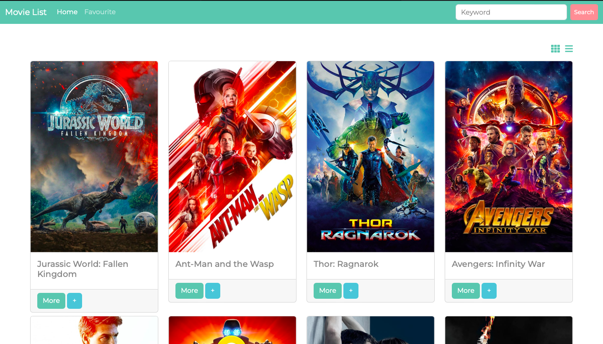

# Movie Lovers Website

This is a website for movie lovers where they can search for movies, view movie details, and add movies to their favourite list.

## Features

The following features are currently available on the website:

- Search for movies by title
- Switch between the List View and Grid View
- View detailed information about each movie, including the plot summary and release date
- Add movies to your favourite list
- Remove movies from your favourite list

## Demo

https://annniewann.github.io/my-movie-list/

## Technologies

The website was built using the following technologies:

- HTML
- CSS
- JavaScript
- Bootstrap
- movie API

## Installation

To run the website locally, follow these steps:

1. Clone the repository: `git clone https://github.com/AnnnieWann/my-movie-list.git`

2. Navigate to the project directory: `cd <repository>`

3. Open index.html in your web browser.
